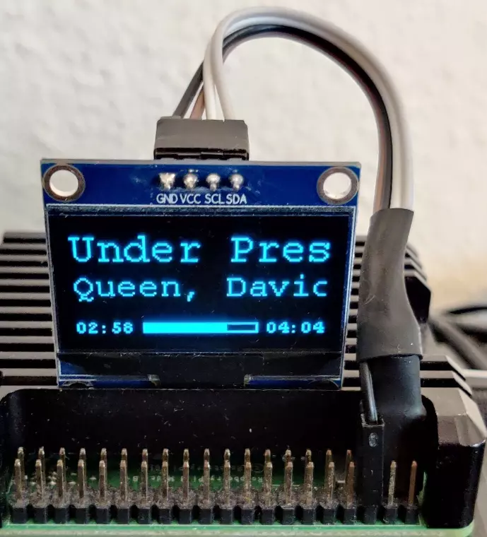

# Spotify-OLED

This is a background service that can be run on a Raspberry Pi or similar, to show information about the song currently playing on the connected Spotify account on a (small) i²c or spi display. \
 \
(Pins from the display connect to those with matching names on the rPI, with VCC=3v3 for this display.)

Features:

* Support for a [wide range](https://github.com/rm-hull/luma.oled#lumaoled) of small displays (without editing the code, hopefully).
* [Configurable](./resources/config.example.ini) text scroll behavior, API polling and frame rate, font type and size, etc.
* Shortening of track titles by removing redundant artist information (feat. XYZ, ABC remix, etc).
* Fairly convenient and secure setup and authentication, see [Setup](#setup) below.


## Requirements

1. An I2C or SPI pixel matrix display supported by [luma.oled](https://github.com/rm-hull/luma.oled).
2. A payed Spotify subscription: Spotify-OLED gets its data through [Spotipy](https://spotipy.readthedocs.io/en/2.19.0/), which requires Spotify API tokens. Those can be created (for one's own account only, and only by users with a payed Spotify subscription) on the [Developer Dashboard](https://developer.spotify.com/dashboard/applications).
3. A computer with working I2C or SPI interface for that display (like a Raspberry Pi). A `/dev/i2c-*` should exist, see the internet.
4. Git, Python(3), and a way to install Python packages (e.g. pip3). On Debian/Ubuntu/Raspberry PI OS/Raspbian, `sudo apt-get install git python3 python3-pip` should do the job.


## Setup

If you rejoiced at the sight of the `./flake.nix`, see the [*NixOS/Nix*](#nixos--nix) section below.


### Manual Installation

This should create a reasonably secure setup on just about any Linux using `systemd`.
With other init services or operating systems, things might get less convenient/secure/stable.

0. Meet the [requirements](#requirements).
1. Clone the repository. For a system wide, non-debug installation, doing this as `root` and to `/opt/spotify-oled/` is probably appropriate, e.g.: `root@pi-or-something:/opt# git clone https://github.com/NiklasGollenstede/spotify-oled.git`.
2. Install the python packages listed in [`./requirements.txt`](./requirements.txt), e.g.: `root@pi-or-something:/opt/spotify-oled# pip3 install -r requirements.txt`. \
   Alternatively to cloning and `pip install` as root, doing that as any user and then `sudo python3 ./setup.py install` also works (but the `font_file` option will need to be set to the absolute path of the font).
3. Copy [`./resources/config.example.ini`](./resources/config.example.ini) and modify with your _own_ app credentials from the [Spotify developer dashboard](https://developer.spotify.com/dashboard/applications).
   Either copy to `./config.ini` to run locally, or for a system install, copy to `/etc/spotify-old.ini` (and optionally link with `ln -sT /etc/spotify-old.ini config.ini` for easier debugging).
   Make the file world-readable, but owned and only writable by root.
4. Test run and authenticate spotify-old, e.g.: `root@pi-or-something:/opt/spotify-oled# ./spotify-old.py --config=/etc/spotify-old.ini`. \
   Follow the prompt, expect song names to be printed and displayed (if something is playing).
5. Copy [`./resources/spotify-oled.service`](./resources/spotify-oled.service) to `/etc/systemd/system/` and adjust the `ExecStart` paths if necessary.
   Make the file world-readable, but owned and only writable by root.
   To start the service: `sudo systemctl daemon-reload && sudo systemctl enable spotify-oled.service && sudo systemctl start spotify-oled.service`.
6. In accordance with the configuration and service files (steps 3 and 5), make the `cache_path` readable and writable by the user or group running the service, e.g.: `root@pi-or-something:~# chown root:spi .../spotify-oled.auth && chmod 660 .../spotify-oled.auth`.

This won't update itself. To do that, in `/opt/spotify-oled/` do `sudo git pull` and then `sudo systemctl restart spotify-oled.service`.


### NixOS / Nix

To get a debug shell with all dependencies, run `nix debug`.
To run the service, run `nix run . -- ARGS`.

To install and configure this service and enable i²c (on a Raspberry PI 4) on NixOS, integrate something along these lines into your system configuration's `flake.nix`:
```nix
{ inputs = {
    spotify-oled = { url = "github:NiklasGollenstede/spotify-oled/master"; inputs.nixpkgs.follows = "nixpkgs"; /* inputs.flake-utils.follows = "flake-utils"; */ }; # ...
}; outputs = inputs@{ self, ... }: {
    nixosConfigurations = { "..." = inputs.nixpkgs.lib.nixosSystem {
        system = "aarch64-linux";
        modules = [ ({ # Configure »spotify-oled«
            imports = [ inputs.spotify-oled.nixosModule ];
            nixpkgs.overlays = [ inputs.spotify-oled.overlay ];
            services.spotify-oled.enable = true;
            services.spotify-oled.client_id = "...";
            services.spotify-oled.client_secret = "...";
            services.spotify-oled.extraConfig.screen = { type = "i2c"; address = "0x3C"; device = "sh1106"; };
        }) ({ pkgs, ... }: { # Enable i²c on a rPI4
            imports = [ inputs.nixos-hardware.nixosModules.raspberry-pi-4 ];
            hardware.i2c.enable = true; # includes »boot.kernelModules = [ "i2c-dev" ]« and some »services.udev.extraRules«
            environment.systemPackages = [ pkgs.i2c-tools ]; # e.g. »i2cdetect«
            boot.loader.raspberryPi.firmwareConfig = "dtparam=i2c_arm=on"; # (combined with the correct dts/b) this turns on i²c on (at least) GPIO2/3 (SDA/SCL) (https://forums.raspberrypi.com/viewtopic.php?t=236915#p1448902)
            loader.raspberryPi.enable = true; loader.generic-extlinux-compatible.enable = pkgs.lib.mkForce false; # (as of nixos-21.05) the latter would disable the former, which would make the above line ineffective
        }) ]; # ...
    }; };
}; }
```
Instructions for authenticating to Spotify will be printed on system activation.

NixOS also allows system integration of a locally modified version, by setting the flakes `inputs.spotify-oled.url` to a local path.
Consecutive rebuilds should then be done with `nixos-rebuild switch --update-input spotify-oled` to ensure nix checks the local clone for changes.


## Debugging

This repo declares its dependencies in both [`./requirements.txt`](./requirements.txt) and [`./setup.py`](./setup.py) and should thus work with standard Python development workflows.

When started with the `--headless` flag, the service won't actually use a display, and should thus run on just about anything, even without i²c or spi.
Almost all debugging (except obviously the output) should work just the same as with a display.


## TODOs

* The service is already fairly configurable, but the layout (two lines of text, with the progress bar underneath) is fixed. The current UI elements (see `MainUI#elements`) are already designed to be set up declaratively, but the corresponding parsing of options is missing.


## Credit

I ([Niklas Gollenstede](https://github.com/NiklasGollenstede)) almost completely rewrote this from [Conor Hennessy](https://github.com/conorhennessy)/[Spotify-OLED-Control](https://github.com/conorhennessy/Spotify-OLED-Control), who originally wrote it with the help of [Alex Hockly](https://github.com/alhockly)/[Spotify-OLED](https://github.com/alhockly/Spotify-OLED).
